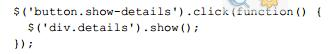
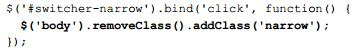

#版权所有。
本书的任何一部分都禁止在获取作者许可之前被复制，存储在可检索的系统或者以任何形式，任何工具传递，除非摘录简短的部分用于重要的文章或者报告中。

在准备这本书的过程中，我们已经尽了很大的努力去确保呈现的信息的正确性，然而这本书包含的信息是以没有任何表示或者暗示的担保下出售的。他的作者、出版商、经销商、散布者都不对这本书造成的或者被断定会造成的直接或者间接的损失承担责任。

Packet Publishing已经尽力通过对首字母适当的使用提供了这本书提到的所有公司的商标信息，然而Packet Publishing不能确保信息的正确性

第一版：2011年9月

产品编号：1160911

#序
我很荣幸的知道Karl Swedberg 和 Jonathan Chaffer承担了书写Learning jQuery的任务。作为第一本关于jQuery的书，他建立了其他jQuery——事实上关于其他javascript的书——努力去达到的标准。自他出版以来，他一直都是顶级javascript畅销书之一，归功于他的质量和对细节的专注。

是Karl 和 Jonathan写这本书让我非常高兴，因为我已经很了解他们两个了，我知道他们是相当适合做这件事情的，作为jQuery团队的一员，在过去的几年中我有机会去近距离的了解Karl，尤其是他努力去书写的书中。看看结果吧，他作为开发者和英语老师的技巧很明显天生就是为这项工作设计的！

我也有机会遇到他们两个in person，这在分散的开源项目世界是一件罕见的事件，而且他们继续成为jQuery社区upstanding的成员。

在jQuery社区，jQuery被如此之多的不同的人使用，这个社区中遍布了经历过编程和那些没有经历过编程的设计师和开发者。甚至在jQuery团队中都有来自各种背景的人提供他们对这个项目方向的反馈，在jQuery使用者中有一个共同之处，那就是：我们是一个开发者和设计者都想让javaScript变得简单易用的社区。

这时候说“开源项目是社区导向的，或者说一个项目的目的是专注于帮助新用户使用”基本上是陈词滥调了，但是它对jQuery来说不仅仅是一个空口号，它是这个项目的液氧燃料，事实是，有很多jQuery项目中的人致力于管理jQuery社区，写文档或者写插件而不是仅仅维持核心的代码基础。尽管jQuery库的健康相当重要，但是环绕在代码周围的社区拥有着错乱平凡的项目和满足甚至超过你的所有需要的不同之处。

我们如何驱动这个项目，您如何使用代码与大部分开源项目——大部分js库有着根本上的不同。jQuery项目和社区非常渊博，我们明白是什么让jQuery成为一中与众不同的编程体验，同时我们仅最大的努力把那些只是传递给后继者。

jQuery社区不是你可以阅读就能理解的，你必须加入到他，深入到其中，我希望你有机会参与到其中。用论坛、邮箱、博客的方式加入到我们之中吧，让我们带领你走过逐渐更好的了解jQuery的经历吧。

对于我来说，jQuery不仅仅是一块代码，他是这些年来产生的驱动他出现的经验的总结，重要的兴盛，为他的发展做的奋斗，还有看到他成长成功的兴奋。和他的使用者后续开发团队一起成长吧，理解他们，努力成长和适应。当我第一次看到这本书谈论jQuery同时把他当一个统一的工具来讨论的时候，与他正在encapsulate for me 的经历相反的是，我有种回到过去而且激动的感觉。看到其他人如何学习理解塑造jQuery以便于适应他们自己是使这个项目变得如此愉悦的主要原因。

我不是唯一的一个不仅仅是普通的“用户-工具”的状态喜欢jQyuery，我不知道是否我可以恰当的描述为什么是这样的，但是我已经一遍又一遍的看到了这种情景——某个时刻，一个用户意识到jQuery到底给予了他很大的帮助，他的脸上露出笑容。

有一个时刻是仅仅属于jQuery的使用者的，当他们意识到他们正在使用的工具事实上不仅仅使一个简单的工具，然后突然之间，他们对如何创造动态web的理解完全提升了。这是一件难以置信的事情，而且绝对是我在jQuery项目中最喜欢的一部分。

我希望你也有机会体验这种感觉。
                                                                                                                                                                     John Resig
                                                                                                                                                                        Creater of jQuery

#关于作者
Jonathan Chaffer是Rapid Development Group中的一员，这是一个座落于Grand Rapids，Michigan的一个web发展公司，他在那里的工作包括审查和执行很多各种不同的技术，重点专注于PHP,MySQL,和javascript。他也引领了一个为web开发者的关于jQuery框架的on-site训练调研班。

在开源社区，Jonathan在Drupal CMS项目中一直都很活跃。这个项目已经使用jQuery作为它的js框架。他是Content Construction Kit的创造者，这是一个流行的在Drupal站点上管理结构内容的模块。他负责主要的Drupal菜单系统的检修和涉及到的API。

Jonathan和他的妻子Jennifer生活在Grand Rapids

>我想感谢Jenny不知疲倦的热情和支持，感谢Karl在精神疲倦的时候继续书写的积极性，感谢Ars Technica社区对优秀技术持续的鼓励。另外，我想感谢Mike Henry和Twisted Pixel团队在书写间隙坚持制造令人愉悦的消遣。

Karl Swedberg是位于Michigan,Grand Rapid的Fusionary Media公司的web开发者，他在那里使用他大部分时间用js创造很酷的东西。作为jQuery团队的一员，Karl负责在api.jquery.com维护jQuery API站点，他也在learningjquery.com的博客中出版教程，出席研讨会和会议。在他不写代码的时候，他喜欢和他的家人一起出去玩，在车库中烤咖啡，或者在当地的cross-fit体育馆中锻炼。

>我想感谢我的妻子Sara和我的两个孩子Benjamin和Lucia为我的生活带来的快乐。同样感谢Jonathan Chaffer和我一起书写本书的耐心和兴趣。

>感谢John Resig创造了这个世界上最好的js库，同样感谢为这个项目贡献了代码、时间、经历的所有人。感谢Packt Publishing的人们，感谢专业的审查技术，jQuery策划，感谢所有的那些一路上提供了帮助和鼓励的一批人。

#关于评审人
Kaiser Ahmed是一个专业的web开发者，他得到了Khulna大学的工程与技术学位，他也是座落于的Bangladesh的完全外包公司CyberXpress.Net的一名程序员。
在IT技术，互联网知识方便他都有很宽泛的涉及，在关于互联网创建和提高多客户端属性方面都有很多经验。他喜欢开发网站和互联网的基本设施，后端使用开源工具（php，mysql，apachre，Linux等等（就是lamp）），前端使用css和html/XHTML。
>他想感谢他可爱的妻子，Maria Akter，的支持。

Kevin Boudloche是一名来自Missssippi的web开发者，他已经持续七年把编程作为爱好，三年专业编程，他的主要关注点是前端的发展和web应用的发展。

Carlos Estebes是Ehxioz，坐落于洛杉矶的软件开发公司，专门开发现代web应用，同时利用最新的web开发技术和方法。他已经有了超过十年的web开发经验，他取得了加利福尼亚大学计算机科学的商学士学位

#关于出版商
支持文件，电子书，打折品等

你一定想进入 www.packtpub.com 寻找支持的文件和与本书相关的下载物。

你知道吗，Packt为每一本出版的书提供可用的PDF和ePub版本的电子版。你可以在 www.packtpub.com 上升级到电子版，而且作为印刷书的顾客，你有权利得到一份电子书的折扣品。使用 service@packtpub.com 与我们取得联系获取更多细节。

在 www.packtpub.com 上你也可以读到a collection of技术文章，签约使用很多免费的来信，接收在packt上关于实体书和电子书独有的折扣，和服务。

对你的it问题你需要立即的解决方案吗？PackLib是Packt的在线数字书库。在这里，你可以接触，可以阅读，可以搜索Packt的全部书籍。

订阅理由
1完全搜索所有由Packt出版的书籍。
2复制，粘贴，打印，标记内容。
3通过浏览器支付和使用。

Packt帐号持有者可以免费进入。
如果你拥有Packt在www.packtpub.com上的帐号，你就可以使用它进入PacktLib，观看所有免费的书籍。使用你的登陆证，现在就进入吧。

#前言
在2005年，受到这一领域的工程师比如Dean Edwards和Simon Willison的启发，John Resig将a set of 函数放到一起以便于在网页上程序化的找到元素以及给他绑定事件。在他于2006年1月份第一次公开的声明了他的项目后，他已经添加了DOM控制和基础的时间。他为之起名为jQuery，目的是强调它的核心角色——查找、查询网页中的一部分，同时通过js来操控他们。在那之后的短短几年中，jQuery已经他的特点中发展了很多，提高了他的表现能力，同时被很多互联网上著名的站点广泛采用。随着Resig依然是这个项目的领头开发者，jQuery已经兴盛起来，以一种真正开源的姿态，以自己拥有一个顶级js开发者队伍和拥有数千开发者的充满生气的社区而荣。

jquery可以加强你的网站而不管你的背景，他用一份简洁的文件提供了大量的特性，容易学习的语法，健壮的跨平台兼容性。另外，数百计的插件已经被开发出来去加强jquery的功能，使他成为了几乎所有客户端脚本环境的基本工具。

Learning jQuery Third Edition提供了对jQuery概念的文雅的介绍，允许你为你的网页添加交互和动画——即使之前书写js的尝试已经使你变得迷惑了。这本书带领你通过Ajax，事件，效果的陷阱，告诉你高级的js语言的特征，为你提供一个清晰简明的jquery库的认识。

#这本书讲了什么
在第一章Getting Started，你将第一次接触到jQuery库，这一章从对jQuery的描述和jQuery能够为你做什么开始讲起。然后带领你下载和使用这个库，同时写下你的第一个脚本

在第二章Selecting Elements，你将学习如何使用jQuery选择器表达式和DOM遍历方法去查找网页上的任意的元素你将使用jQuery去修改页面中各种元素的样式，有时候会使用一种单纯css做不到的方法。

在第三章Handling Events你将使用jquery事件处理技巧去在浏览器事件发生时产生行为。你将看到jquery如何不唐突的为元素绑定事件，甚至是在页面加载完之前。同样，你将看到一个更深主题的概述，比如事件冒泡，委托，和命名空间。

在第四章Style and Animation，你将被介绍jquery的动画技术，学习如何隐藏，展示，使用有用而且对眼睛友好的方式去移动元素。

在第五章Manipulation the DOM 你将学习如何改变你的网页，这一章将教给你如何修改html文档的页面结构和内容。

在第六章Sending Data with Ajax，你将学习很多jquery使之很容易接触到服务器端编程的方法，而不用求助于沉重的页面刷新。手头有着jquery库的基础组建，你已经准备好了探索jquery如何扩展去满足你的需求。

在第七章Using Plugins，将展示给你如何找到，安装和使用插件，包括强大的jqueryUI插件库。

在第八章Developing Plugins，你将学习如何好好利用jquery的令人深刻的扩展能力去从零开始开发你自己的插件。你将开发你自己的实用的方法，添加jquery方法，探索jqueryUI装饰库。接下来，你将第二次探索jquery搭建块，学习更多高级的技术。

在第九章，Advanced Selectors and Traversing，你将改善你关于选择器和遍历器的知识，增加为性能提供最优选择器的能力，操控DOM元素块，书写插件，扩展选择和遍历的能力。

在第十章，Advanced Events，你将更加深入学习委托和延迟加载技术，这可以很大的提高你时间处理的性能。你也能创建定制的特殊事件，为jquery库添加更多能力。

在第十一章，Advanced Effects，你将调整jquery通过精心制作的定制的简单方法和对一个动画效果每一步的反射而产生的视觉效果。你将得到在动画发生时操控他们的能力，和通过定制序列制作的日程事件。

在第十二章，Advanced DOM Manipulation，你将获取更多修改DOM结构的练习，比如使用为元素绑定任意数据的技术。你也将学习如何扩展jquery在元素上处理css属性的的方法。

在第十三章，Advanced Ajax，你将对Ajax实物有一个更深刻的理解，包括在不久的未来可能变的有效的处理数据的jquery延迟对象系统。

在附录A，javascript Closures，你将获取一个扎实的对js中子句的理解——他们是什么，你如何利用他们。

在附录B，Testing javascript with QUnit，你将学习Qunit库用来单元测试js程序。这个库将被添加到你的工具箱去开发和维护高度复杂的web应用程序。

在附录C，Quick Reference，你将快速瞥一下全部的jquery库，包括每一个方法和选择器表达式，当你知道你想做什么的时候，jquery的简便查找的语法非常完美，但是你就是不确定正确的方法名称或者选择器语法。

#你需要为这本书准备什么
为了让这本书中演示的例子跑起来，你需要一个现代浏览器，比如Mozilla Firefox,Apple Safari,Google Chrome 或者IE。
 为了试验范例，处理每一章结束时候的练习，你将需要：

1. 一个基础的文本编辑器
2. 浏览器的web开发工具，比如Firebug，正如第一章开发工具小节描述的那样。
3. 每一章的完全代码包，包括jquery库的拷贝。请看下面的下载范例代码小节。

另外，为了能运行第六章及以后几章中ajax的范例，你需要一个支持php的web服务器。

#这本书是为谁准备的
 这本书是为了那些想为自己的设计创建交互式元素，为自己的应用创建最好的用户界面的人准备的。你需要有基础的js知识。你也需要知道基础的html和css知识，应该适应js的语法。我们假定你没有jquery的知识，使用其他js库的经历也不是必须的。

通过读这本书，你将熟悉jquery1.6.x的功能和语法，这是开发的最新的版本。
 
#jquery项目的历史
 这本书涵盖了jquery1.6.x的功能和语法，这是开发的最新版本。jquery背后的承诺——提供简单的查找和操控元素的方法——自这个项目发展以来没有改变过，但是一些语法细节和特点修改过。这个项目历史的简洁的概览描述了一个个版本最重要的改变，这可能对那些使用过jquery遗留版本的读者有所帮助。

公开开发阶段：John Resig在2005年八月首次做了一个要在Prototype行为库上做一个提升。这个新的框架在2006年一月十四日作为jquery正式发布。

jquery1.0 2006年8月，这是第一个稳定的发布版本，已经对css选择器，时间处理，ajax交互有了健壮的支持。

jquery1.1 2007一月，这一版使api变得更加合理，很多很少用的方法联合起来，减少了需要学习的方法和文档的数量。

jquery1.1.3 2007七月，这一个次要的发布版本包含了jquery选择器引擎的巨大的速度提升。从这一版开始，jquery的性能已经可以与其他js库比如Prototype，Mootools，Dojo相竞争了。

jquery1.2 2007年九月，选择元素的xpath语法在这一版中被移除，因为在有css选择器语法的情况下这已经是很多余的了。影响定制在这一版中变的更加灵活，添加了命名空间事件让插件开发变的更加容易。

jquery ui 2007九月，新的插件库被宣布要替代流行但是陈旧的界面插件。很多预先想好的桌面装饰被包含了进来，同时还有一系列创建如同托拽的复杂元素的工具。

jquery1.2.6 2008五月，Brandon Aaron的Dimensions插件功能被添加进入核心库中。

jquery1.3 2009一月，对选择器引擎(sizzle)的检查对jquery提供了一个巨大的性能提升。事件委托被正式支持。

jquery1.4 2010一月，这一版或许是自1.0以来最有雄心的更新，对DOM操控方面带来了很多性能提升。同时对jQuery几乎每一个方面都谭家了很多全新的或者增强的方法。1 .4版本在一个专用的网站http://jquery14.com上展示了14天的声明和视频。

jquery1.4.2 2010年一月。两个新的事件委托方法.delegte().undelegate()被添加了进去，jquery的全部的事件系统对灵活的应用和浏览器方面更好的一致性看起来有了一个综合的修整。

jquery mobile2010年八月。jquery项目公开描述了使用jquery做手机网站的策略，研究和 ui设计，在http://jquerymobile.com发布了一个新的手机框架。

jquery 1.5 2011年一月。ajax组件经历了一次主要的重写，添加了更强大的延展性和性能提升。另外，jquery1.5包含了承诺处理同步和异步函数列队的实现。

jquery1.6 2011年五月。属性组件重写了更加精确的反映html属性和DOM属性之间的区别。同时，被添加到jquery1.5的延迟对象有了两个新方法。.always()和.pipe()。

历史细节
可以在项目网站http://jquery.org/history上找到之前的jquery版本的发布的细节。

#约定
在这本书中，你将发现很多在不同种的信息中有区别的文字风格。下面使一些这些风格的范例和对他们含义的解释。

当我们希望吸引你的注意力到代码块中特定的部分的时候，相关行或者术语将被加粗展示：

新术语和重要的词汇将会加粗展示。比如你在屏幕、菜单或者对话框中看到的单词将会在段落里像下面这样展示：“控制面板将会成为我们学习jquery时使用最频繁的东西，正如下面的截图所展示的那样”。

警告和重要的注释将会想这样在盒子中展示。

小技巧将这样展示。

#读者反馈
欢迎来自我们读者的反馈，让我们知道你认为这本书怎么样——你喜欢什么或者可能你不喜欢什么。读者反馈对我们来说去准备你可以充分利用的标题是相当重要的。

给我们发送常规的反馈，可以发送邮件到feedback@packpub.com，同时在你的信息的主题中提到这本书的标题。

如果有一本书你需要，而且想让我们出版，请在www.packtpub.com上在“建议一本书”表单上给我们发一个注解，或者给suggest@packtpub.com发邮件。

如果你对某一个主题很专业，而且你对写一本书或者参与到一本书的书写很有兴趣，请参考www.packtpub.com上的作者指引。

#顾客支持
现在你已经是一本Packet书籍的光荣读者，我们可以做很多事帮助你好好利用你的这次购买。

#下载范例源码
你可以使用你在http://www.packtpub.com上购买书籍的下载下载范例代码文件。如果你在其他别的地方购买的这本书，你可以访问http://www.packtpub.com/support然后注册，直接把这些文件发电子邮件给自己。

#勘误表
 尽管我们已经尽我们最大的努力去确保我们内容的正确性和发生的错误。如果你在我们的一本书中发现饿错误——或许是文本或者代码中的错误——我们将很感激你把错误反馈给我们。通过这样做，你可以让我们的读者免于挫败感，帮助我们提高这本书的后续版本。如果你找到了任何错误，请访问http://www.packtpub.com/support选择这本书点击错误提交链接，输入错误的细节去提交错误。
 
一旦你的错误被确认了，你的提交将被接受，同时这个错误将被上传到我们的网站，或者添加到已经存在的该标题选项下的勘错表列表中。在http://www.packtpub.com/support选择你的标题可以看到所有存在 勘错表。

#盗版
非法翻印网络上有版权的材料在现在是遍及所有媒体的问题。在packt我们严肃保护我们的版权和许可证书。如果你看到我们工作的任何形式的任何非法的复制，请立即提供给我们地址或者网站名字，让我们可以及时补救。

请给copyright@packtpub.com发含有有嫌疑的非法材料的网址邮件联系我们。

我们很感谢你帮助我们保护我们的作者，和我们给你带去有价值的内容的能力。

#问题
如果你有关于这本书任何方面的问题，你可以通过questions@packtpub.com联系我们，我们将尽我们最大的努力解决它。
