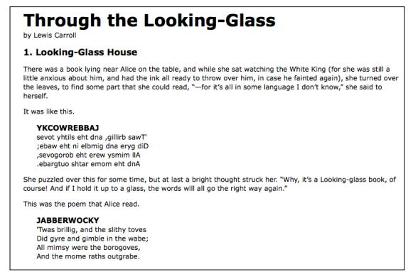

#第一章
今天的万维网是一个不断变化的环境，而且他的使用者给网站的外观和功能都设定了一个很高的期待。为了建造有趣的，交互的网站，开发者们开始致力于诸如jQuery的javaScript库以便于自动完成平常的任务，简化复杂的任务。jQuery流行的一个原因就是它帮助解决许多不同问题的能力。

了解从哪里开始可能看起来是有挑战性的，因为jQuery执行了如此多的不同的功能。然而jQuery库的设计存在连贯性和对称性，他的很多概念是从HTML和CSS中借鉴过来的。The library's design lends itself to a quick start for designers withlittle programming experience as many of them have more experience with these technologies than they do with JavaScript.事实上，在这个开篇章节，我们将用仅仅三行代码写下一个运行的jQuery程序，另一方面，有经验的程序员也会从这种一致的概念中受益，正如我们将来会看到的更多高级的章节。

接下来我们看一下jQuery可以为我们做什么。

##jQuery可以做什么

jQuery库为通用的web脚本提供了一个多用途的概念层级，因此在几乎所有的脚本环境中都是有用的。他的可扩展性因为这我们不可能在一本书中覆盖他的全部可能的使用方法和功能，正如插件不断的被开发出来去添加新功能。不过，他的核心功能帮助我们完成下面的功能。

- 存取文档元素：假如不使用js库，web开发者通常需要写很多行代码去遍历DOM树、找到在元素HTML结构中明确的位置。但是通过jQuery他们将会有一个强大且高效的选择器提供使用，这让检索那些需要被检索或者操作的文档部分变的很容易。

 `$("div.content").find("p");`
 
- 修改页面的展现样式：css提供了一个影响页面渲染的有力方法，但是有一点不爽的是，不是所有的浏览器都支持相同的标准。使用jquery，开发者可以依赖所有浏览器都支持的标准度过这些空缺。另外，甚至在文档渲染以后，jquery也可以改变应用于部分文档上的类和style。
修改文档内容：不局限于仅仅美化页面的改变，仅仅敲几下键盘jquery就可以修改文档的内容，文本可以被修改，图片可以被插入或交换，列表可以被重新整理，全部的文档结构可以被重写或扩展---全部依靠一个简单使用的api。

`$("#container").append("<a href='more.html'>more</a>");`

- 对用户的交互作出反应：甚至最精心制作的有力的行为如果我们没有在他们发生的时候没有控制他们都是没有用的。jquery库提供了高雅的方法去处理很多种的事件，比如用户点击一个链接，而不用使用事件处理去混乱html代码。同时事件处理api还移除了通常折磨web开发者的兼容性问题。
代码

- 为文档添加动画改变：为了有效地实现交互行为，设计师必须也为用户提供一个视觉反馈。jquery通过提供一个效果数组，比如淡出，清除和精心制作图象展示的工具箱，实现了这一点。

- 无刷新的从服务器取回数据：这种代码模式已经以ajax的名字被大家熟知，代表异步的javascript和XML，但是他已经代表了一个更加强大的在客户端和服务器端交流的技术。jqery库从这个响应的很有特点的进程中移出了浏览器的复杂性，允许开发者关注服务器端的功能。
代码

- 简单的js任务：除了所有的这些文档明确的jquery特点以外，jquery提供了基础js概念的增强，比如迭代和数组控制。

###下载范例代码
你可以使用你在http://www.packtpub.com上购买书籍的下载下载范例代码文件。如果你在其他别的地方购买的这本书，你可以访问http://www.packtpub.com/support然后注册，直接把这些文件发电子邮件给自己。

##为什么jquery工作的很好
随着对动态html内容的兴趣的复苏，已经产生了很多js框架，一些专门化的关注于仅仅一两个的以上的任务。其他企图处理所有可能的行为和动画，服务所有的没有希望的简易包装。为了在相对简单的同时实现上面提到的很大范围的特点，jquery使用了以下几个策略。

- 使用css的知识：通过使用css选择器查找元素的机制，jquery继承了一个简洁的清晰的表达文件结构的方法。jquery成为了想为自己的网页添加行为的设计师开始的点，因为做专业的wen开发的先决条件就是有css语法知识。

- 支持扩展：为了避免功能变更，jquery把特殊场景下使用的功能交由插件实现。创建新插件的功能很简单而且文档写的很好，这鼓舞了很多中的有用的模块的发展。大部分的下载下来的基础jquery中的大部分特点在内部通过插件机制实现，如果需要的话，可以被移除，生成一个甚至更小的js库。

- 解决浏览器兼容性问题：对web开发来说，有一个不幸的事实——每一个浏览器都有自己一系列的与发布的标准的偏差，对任何一个web应用来说，一个重要的部分就是处理每一个平台的不同。然而多种浏览器平台胆汁创造完美的浏览器兼容的待吧对某些高级的功能来说使几乎不可能的。jquery添加了一个抽象层，使这些平常的任务变的正常，在简化的同时缩短了代码的大小。

- 同时处理一系列元素：当我们命令jquery："找到所有带有collapsible的类，并隐藏他们"，我们不需要通过每一个返回的值循环操作。相反，.hide()这样的方法被设计的就是自动和一系列的对象一起工作。而不是和分离的。这种技术被称之为隐式迭代，意味着很多循环可以不是必须的，优雅的减少了代码。

- 允许在一行代码中操纵多个动作：为了避免滥用临时变量和浪费的重复，jquery使用了被称之为chaining的编程模式作为他的方法的主体。这意味着对一个对象的大部分操作的返回值是这个对象自己，准备好了让下一个操作去使用。

这些策略让jquery变的很轻，压缩后大约只有30kb，同时提供技术让我们让使用了jquery的普通的代码变的简洁。

jquery代码的优雅部分源于设计，部分源于受围绕jquery如雨后春笋般建立的充满生机的社区的鼓舞而发生的进化。jquery的用户聚集在一起不仅仅讨论开发插件，同时讨论增强核心库的功能。用户和开发者也帮助持续提高官方项目的文档，你可以在 http://api.jquery.com上找到这些文档。

尽管付出了很大的努力去开发这样灵活而且健壮的系统，最终的产品依然是对所有人免费的。这个开源项目在MIT许可（允许在任何站点上免费使用jquery，同时在正确的软件上正确的促进他的使用）和GNU公共许可（包含其他GNU许可的开源项目是可以的）的双重许下。

##我们第一个使用jquery的网页
现在我们已经讲过了使用jquery对我们有用的特点的范围，我们可以测验如何实际使用jquery了。为了开始，我们需要复制一份jquery。

##下载jquery
无需安装。为了使用jquery我们需要一份这个文件公开可用的复制，无论是在一个外部网站上还是我们自己网站上获取的。正如js是解释型的语言，不必担心编译和生成阶段。无论什么时候我们需要让jquery在一个网页上可用，我们只需要简单的在html文档中的`
 </ head>
<body>
<h1>Through the Looking-Glass</h1>
by Lewis Carroll


<h2 class="chapter-title">1. Looking-Glass House</h2>
There was a book lying near Alice on the table, and whi le she sat watching the Whi te King (for she was still a little anxious about him, and had the ink all ready to throw over him, in case he fainted again), she turned over the leaves, to find some part that she could read,

"&mdash;for it's all in some language I don't know,"
</ span>
she said to herself. </ p>
It was like this.
 

<h3 class="poem-title">YKCOWREBBAJ</h3> 

sevot yhtils eht dna ,gillirb sawT'
 
;ebaw eht ni elbmig dna eryg diD
 
,sevogorob eht erew ysmim llA
 
.ebargtuo shtar emom eht dnA

 

She puzzled over this for some time, but at last a bright thought struck her.

"Why, it's a Looking-glass book, of course! And if I hold it up to a glass, the words will all go the right way again."
</ span> </ p>
This was the poem that Alice read.
 

<h3 class="poem-title">JABBERWOCKY</h3> 

'Twas brillig, and the slithy toves
 
Did gyre and gimble in the wabe;
 
All mimsy were the borogoves,
 
And the mome raths outgrabe.


 

 </ body>
</html>`

###文件路径：

服务器上文件的真实布局不会造成影响，从一个文件到另一个文件的引用需要调整去适应我们选择的组织结构。在这本书的大部分例子中，我们将使用相对路径（../images/foo.png）而不是绝对路径（/images/foo.png）这将让我们的代码在无需web服务器的情况下也能运行。

在html文件展示后，接下来是css文件被下载下来，比如，我将使用下面的代码：
`body {
background-color: #fff;
color: #000;
font-family: Helvetica, Arial, sans-serif;
}
h1, h2, h3 {
margin-bottom: .2em; }
.poem {
margin: 0 2em;
}
.highlight {
background-color: #ccc; border: 1px solid #888; font-style: italic; margin: 0.5em 0; padding: 0.5em;
}`

在css文件被引用后，js文件也被包含进去了。引用jquery库的script标签被放置在其他一般的script标签前面是很重要的，否则我们的代码在企图使用jquery的时候将会变的无效。

> 在这本书剩余部分，只有html和css文件的相关部分才会被打印出来，文件的全部可以在这本书的相关站点http://book.learningjquery.com找到。

现在我们有了一个看起来像下面这样的截图的网页。

我们将使用jquery为网页添加新的样式。

> 这个例子是用来展示jquery的简单使用方法，在真实场景中，这种样式应该完全使用css来展示。

##添加jquery代码
我们的普通的代码将书写在后面的现在还是空的js的文件中，我们在html中使用 ``把文件包含进去。比如我们只需要下面这样的三行代码。
`$(document).ready(function() { $('div.poem-stanza').addClass('highlight ');
});`


###查找poem text

jquery最根本的操作是查找文档的一部分，这一点使用$()方法来做到。一般来说，它使用一个字符串作为参数，其中可以包含css选择表达式。在这种场景下，我们希望查找到文档中所有有着poem-stanza类的div元素，所以选择器将会很简单。然而，我们希望通过这本书的教程，我们可以学会更加复杂的操作。我们将在第二章"查找元素"中逐步使用多种方法定位文档的部分。

当＄()被调用的时候，会返回一个新的jquery对象实例，从现在开始这将是我们将要处理的基本的构建内容。这个对象封装了零个或者更多的dom元素，同时允许我们使用多种方法去影响他们。在这种情况下，我们希望修改网页中这些部分的表现形式，我们将修改附加到网页中的类的方法实现这一目标。

###注入新类
.addClass()方法和大多数的jquery方法一样，是使用自己的功能描述来为自己命名的。他将为我们选中的网页中的那一部分添加新的类，他唯一的参数是需要被添加的类的名称。只要我们找到对我们有效的不同的选择器，这个方法和他相应的方法.removeClass()让我们可以很容易的使用jquery。现在，我们的例子只是简单的添加了一个highlight类，我们在css文件中把他定义为有着灰色背景和边框的斜体文本。
注意，我们不需要迭代为所有的查找到的元素添加类，正如我们讨论的那样，jquery在诸如.addClass()方法中使用隐式迭代，因此单独调用一个方法就是我们去修改被选中的文档中所有内容所做的事情。

###执行代码
使用$()和.addClass()对我们来说足够完成我们修改文档表现这一目标。然而，如果这行代码仅仅被插入到文档的头部，他将不起作用。js代码当他遇到浏览器的时候就会执行，在这时头部文件正在被处理，可是还没有html文档被展示出来。我们需要延迟执行这些代码，直到dom结构对我们来说可以用了。

使用$(document).ready()结构，jquery允许我们在DOM结构被加载后去执行函数，而不必等待到所有的图片被完全渲染后。虽然不使用jquery的帮助，事件安排也是能做到的，但是$(document).ready()提供额一个想到优雅的跨浏览器解决方案，如下：
- 当有效的时候使用浏览器本地的DOM接口，同时添加window.onload()事件处理作为安全网。
- 允许多次调用$(document).ready()，同时按照他们被调用的顺序执行代码。
- 执行传递给$(document).readu()中的函数，甚至他们是在浏览器事件已经发生后被添加的。
- 异步处理事件调用，允许脚本在必须的时候延迟调用。
- 通过不断的重复检查在DOM存在时同时存在的方法，在旧的浏览器中模仿DOM加载完成的事件。

.ready()方法的番薯可以接受一个已经定义了的函数的引用，正如在下面的代码片段中展示的那样：
`funct ion addHighl ightClass() { 
	$('div.poem-stanza').addClass('highlight ');
} 
$(document).ready(addHighlightClass);`

然而，正如在这个脚本原始代码中展示的，在1.2小结重复的那样，就像下面那样，这个方法同样可以接受一个匿名函数（有时候被称之为lambda函数），如下：
`$(document).ready(function() { 
	$('div.poem-stanza').addClass('highlight ');
});
`

当函数作为参数同时不需要复用的时候，匿名函数对jquery代码来说是很方便的。而且，他创建的闭包可以成为一个高级有力的工具。然而，如果不小心处理的话，可能会在内存使用中产生非计划中的结果和分值。闭包主题将在Appendix A JavaScript Closures章节中仔细讨论。

###完成的产品
现在我们的js代码已经放置好了，网页看起来就像下面这个截图一样

显示的内容现在是斜体的并被边框包围着，正如01.css中定义的那样，由于通过js代码插入的highlight类。

##原始的js代码和jquery对比

在我们自己处理的时候，甚至是这么简单的任务在不使用jquery的时候都会变得复杂。用原始的js，我们可以使用下面的代码片段添加highlighted类：
`window.onload = function() {
var divs = document.getElementsByTagName('div'); for (var i = 0; i < divs.length; i++) {
if (hasClass(divs[i], 'poem-stanza')
&& !hasClass(divs[i], 'highlight')) { divs[i].className += ' highlight';
} }
function hasClass( elem, cls ) {
var reClass = new RegExp(' ' + cls + ' '); return reClass.test(' ' + elem.className + ' ');
} };`

尽管很长，但是这个解决方案依然没有处理很多jquery在列表1.2中为我们做到的一些事情，比如下面的这些：
- 合适的处理其他的window.load事件
- 在DOM结构准备好的时候开始行动。
- 使用现代的DOM方法优化元素查找和其他任务。

我们可以清晰的看到我们的使用query的代码比原生js代码写起来更容易，读起来更简单，运行起来更快。

##开发工具
正如展示的代码对比，jquery的代码和原生js代码对比要更短，更清晰。然而，这不意味着，我们将总是能够写出没有bug的代码，或者我们总是能直观的理解正在我们的网页上发生了什么。借助于标准的开发工具，我们的jquery代码体验将变的更加流畅。

高质量的开发工具在所有的现代浏览器中都是是可以找到的，我们可以自由使用对我们来说最舒适的环境。可选项包括：

1. IE开发者工具http://msdn.microsoft.com/en-us/library/dd565628.aspx
2. Safari web工具http://developer.apple.com/technologies/safari/developer-tools.html
3. Chrome开发者工具
http://code.google.com/chrome/devtools/
4. 火狐中的firebug
http://getfirebug.com

这些工具提供了类似的开发特点，包括：
1、探索和修改DOM展示的能力
2、研究css和他在网页中呈现效果的关系。
3、通过特殊的方法方便的追踪js的执行。
4、暂停正在执行的脚本，查看变量的值。

尽管这些特点的细节在不同浏览器中是不同的，但是一般的概念是相同的。在这本书中，一些例子需要使用其中的一种工具，我们将使用firebug作为展示，但是其他浏览器中的开发工具也是很好的替代品。

###firebug
关于firebug的最新的安装使用说明可以在这个项目的首页http://getfirebug.com上找到，这个工具太复杂了以至于我们不能在这里展示很多细节，但是一些最常用的特点的总结对我们来说是很有用的。

理解这些截屏
firebug是一个快速迭代的项目，因此下面的截屏可能和你的环境不是那么匹配。一些标签和按钮由可选的FireQuery插件提供：http://firequery.binaryage.com/
当firebug被激活后，一个新的面板将展示出来提供当前页面的信息。

在面板的默认的html标签上，我们可一看到我们可以看到左侧的页面结构的呈现，和被选择元素的细节（比如应用在其上的css规则），这个标签页对研究页面的结构和调试css的问题是相当有用的，正如下面的截屏中展示的那样。

Script标签页允许我们查看网页中所有的话加在的脚本的内容，正如之前的截屏展示的那样。通过点击行号，我们可以设置一个断点，当脚本执行到断点的那一行，他将会暂停，直到我们点击按钮继续执行。在这个页面的右侧，任何时候，我们都可以输入我们希望知道的一列变量和表达式
图片。

Console标签将使我们在学习jquery的时候使用的最多的标签，正如下面的截屏展示的那样。面板底部的文本区域允许我们输入任何js表达式，这个表达式的结果将会展现在面板上。

在这个例子中，我们已经在1.2列表中展示了相同的jquery选择器，但是还没有在被选择的元素上展示任何行为。尽管这样，这个表达式给了我们一个有趣的信息。我们看到选择器的结果是一个指向两个.poem-stanza元素的jquery对象。我们可以使用这个控制特点在任何时候直接在浏览器中快速的测试jquery代码。

`$(document).ready(function() { console.log('hello'); console.log(52); console.log($('div.poem-stanza'));
});`

这段代码说明了我们可以传递给console.log()任何种类的表达式，像字符串和数字这样的简单值将会直接被打印出来，像jquery对象这样的更加复杂的值将会以很好的格式呈现给我们，比如下面的截屏展示的那样：
图片。

console.log()方法（在我们提到的每一个浏览器的开发工具中都是可以使用的 ）可以很方便的使用js的alert（）方法替换，这对我们测试我们的jquery代码是很有用的。

##总结

我们现在已经知道了为什么额开噶者选择使用js框架而不是从头开始书写代码，甚至是最简单的代码都这样。我们也看到了，作为一个框架jquery擅长的地方，为什么我们选择它而不是其他选择，和一般而言jquery会使哪些任务更加简单。

在这一章中，我们已经学写了如何让jquery在我们网页中的js中执行，使用$()方法定位网页中一个已经由跟定类的部分，调用.addClass()方法为页面中这一部分添加其他的风格，调用$(document).ready()使这在代码在网页一加载结束的时候去执行。我们已经研究过了我们在书写，测试和调试我们的jquery代码时需要依靠的开发工具。

我们使用的这个简单的例子展示了jquery是如何工作的，但是在真实的场景中并不是很有用的。在下一章节，我们将通过探索jquery的复杂的选择语言扩展此处的代码，发现这一技术的实用价值。

        
    