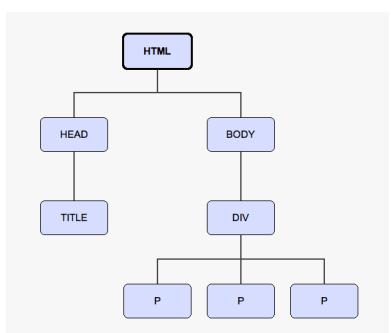
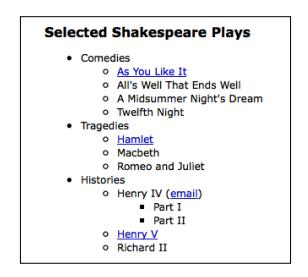
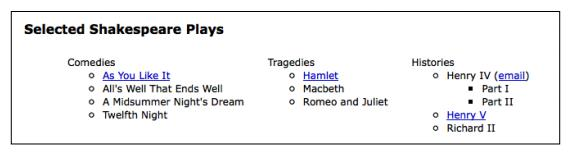
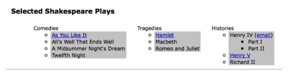
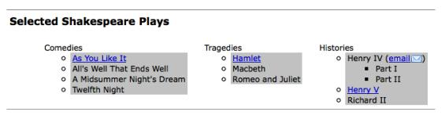
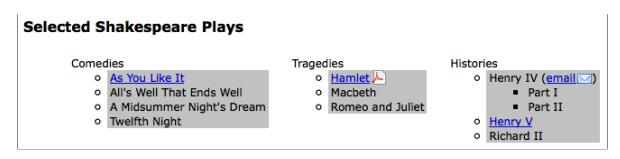
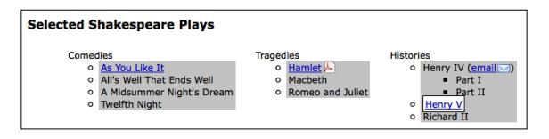

#选择元素
jquery使用css选择器让我们快速而容易的接触到DOM结构中的元素或者一组元素。在这一章中，我们将探索这些选择器中的一部分和jquery自己的选择器。我们也将查案jquery提供了更加灵活的让我们获取我们想要的东西的DOM遍历方法。

##文档对象模型
jquery最有力的能力之一是它使选择DOM结构中元素的变的容易的能力。文档对象模型作为js和网页的接口存在，他提供了基础html作为对象网而不是简单的文本的存在。

网状结构在网页上表现为家庭图谱的形式。当我们涉及到一个元素和其他元素的关系时，我们使用实际到家庭关系的术语：双亲，子代等等。一个简单的例子可以帮助我们理解家庭图谱如何映射到文档中的，如下：
代码

在这里，<html>shi 所有其他元素的祖先，换句话说，所有其他元素是<html>的后代。 <head>和<body>元素不仅仅是后代元素，还是<html>的子代元素。同样的，<html>不仅仅是他们的祖先元素，也是他们的父代。
元素是
的子代元素也是后代元素，也是<body>和<html>的后代元素，也是其他
的兄弟元素。正如下面的图表展示的那样。

为了帮助让DOM结构的家庭书结构变的更加形象，你可以使用一些软件工具，比如firefox上的firebug插件，或者Safari或者Chrome上的web探测器。

通过我们使用的元素树状图，我们可以使用jquery去有效的定位网页上的任何元素。我们实现这一点的工具就是jquery选择器和遍历方法。

在我们开始前，一个需要指出的重要一点是选择器和方法得到的结果中石碑jquery对象包围。当我们想实际在我们从网页上查找到的元素上做一些事情的时候，使用这些jquery对象将是很容易的。我们可以很容易的在这些对象上绑定事件，为他们添加流畅的影响，同时一起链状的修改影响他们。jquery对象与常规的DOM对象或者节点列表是不相同的，并没有必要的为一些任务添加相同的方法和属性。因此在这一章节的最后部分，我们将看一下直接接触被jquery对象包围着的DOM对象。

##$()方法
无论我们想在jquery中使用哪种类型的选择器，我们总是使用相同的函数$()开头。这个函数典型的接受一个css选择器作为他的基础的元素，然后作为一个工厂放回一个指向网页上相应元素的的新的jquery对象。任何能被样式表使用的东西都可以作为字符串传递给这个方法，允许我们把jquery方法应用到匹配的元素上。

使jquery和其他js库和谐相处
爱jquery中，美元符号$shi jquery的一个别名，然而一个$()方法在js的库中是很常见的，如果一个网页中使用了多个这些库，可能就会发生冲突。我们可以通过把我们的代码中所有的$替换成jquery来避免这样的冲突。这个问题的其他解决方案再第十章高级事件中介绍了。

三种基本的选择器构建元素分别是tag name ckass和id他们可以单独使用，也可以和其他结合起来使用。下面的简单的例子说明了这三个选择器如何在代码中呈现的。

- tag name      选择文档中所有的段落
- ID            选择文档中唯一的一个ID是some－id的元素
- Class         选择文档中有着some-class这个类的元素。

正如第一章：入门指南中介绍的那样，当我们调用jquery对象的方法的时候，我们传递给$()的选择器选中的对象将会自动隐式的循环。因此我们通常可以避免通常在DOM脚本中需要的显式调用。

现在我们已经讲述过了基础知识，我们准备好了去开始探索一些更加高级的选择器的使用。

##css选择器
jquery支持几乎所有的css1到3的规范，在世界万维网协会网站http://www.w3.org/Style/css/specs有一个概述。这份支持允许开发者扩展他们的网站，而不用担心这是哪一个浏览器（尤其是IE6）或许不懂高级选择器，只要浏览器支持js脚本就行。

渐进增强
有责任感的jquery开发者应该总是应用渐进增强和优雅降级的概念到自己代码中，确保这个网页将会精确的渲染，即使在js被禁用后不是像启用js后的那么漂亮。我们将在整本书中继续探索这个概念。
为了开始学习jquery如何使用css选择器工作，我们将使用在很多网站上出现的结构，通常是导航，一个嵌套的无序的列表：
代码

注意到第一个ul标签有一个selected-play ID，但是任何一个li标签上都没有类。在没有任何样式的情况下，这个列表看起来就像下面的截图一样。

这个嵌套的列表现实的好像我问期望他是一系列元素垂直排列，然后根据级别缩进。

##为项目列表添加样式

假设我们想要顶部元素，而且只想要顶部元素水平排列。我们可以先在样式表中定一个horizontal类。
horizontal类让元素浮动到他后续元素的左侧，去掉了他的项目图标，在他的各个方向添加了10像素的边距。
我们动态的在顶部元素（仅仅Comedies,Tragedies,Histories）添加了horizontal类，而不是直接在html标签上添加，展示了jquery作为选择器的使用，如下：
代码
正如在第一章中讨论的那样，我么通过调用$(document).ready()开始我们的jquery代码，他会在DOM加载结束后执行传递给他的代码，而不是之前。
第二行使用子代选择器仅仅为顶部元素添加horizontal类。他的作用是，$()内部的选择器方法正在说："找到每一个有着selected-play ID的元素的子元素列表项目(li)"。
在这个类现在被应用后，定义在样式表中的这个类的规则产生了作用。现在我们的嵌套列表看起来像下面的截图一样：

为所有的其他元素加上样式——所有的不在顶部的元素——可以使用多种方法实现。正如我们已经为顶级元素加上了top-level元素，一个选择子级元素的方法就是使用反向选择类去确定所有的没有添加horizontal的列表项目。注意下面添加的第三行代码：
代码

这一次，我们选择每一个列表元素li：
是selected-plays ID的后代元素(#delected-plays)
没有horizontal类(：not(.horizontal))

##属性选择器
属性选择器是一个相当有用css选择器的子集。

它允许我们通过一个元素的html属性去明确一个元素，比如一个链接的title属性或者一个图片的alt属性。

比如，为了选择所有有着alt属性的的图片，我们写下下面的$("img[alt]")属性选择器，接受一个使用有规则的表达式的通配符语法用来明确一个字符串开始（^）和结束（$）的值。

他们也可以使用星号（＊）去表明在某一个位置有某个值，或者使用叹号（！）去表明一个相反的值。

##为链接添加样式

我们想让不同的链接有不同的颜色，我们首先在样式表中定义样式，如下：
`a{
color: #00c;
}
a.mailto {
background: url(images/mail.png) no-repeat right top;
padding-right: 18px; }
a.pdflink {
background: url(images/pdf.png) no-repeat right top; padding-right: 18px;
}
a.henrylink {
background-color: #fff; padding: 2px;
border: 1px solid #000;
}
`


然后，我们添加三个类——mailto，pdflink和henrylink——使用jquery确定链接。

为了给所有的email链接加上一个类，我们建立了一个选择器，找到了所有的有着href属性的锚元素，而且是以mailto开头的：（^="mailto"）如下：

`$(document).ready(function() { $('a[href^="mailto:"]').addClass('mailto');
});`

由于在页面的样式表中定义的规则，一个信封的图片将显示在页面上所有的mailto链接后面，正如下面的－展示的那样：


为了给所有到PDF文件的链接加上一个类，我们使用美元符号而不是脱字符号^。这是因为我们正在选择一个href属性是以.pdf结尾的链接，如下：
`$(document).ready(function() { $('a[href^="mailto:"]').addClass('mailto'); $('a[href$=".pdf"]').addClass('pdflink');
});`

新添加的pdflink类的样式规则在每一个到PDF文件的链接后面加上了一个Adobe Acrobat图标，正如下面的截屏显示的那样：

属性选择器也可以连接使用，比如，我们可以为所有以http开头，而且在某个位置含有henry的href属性添加一个henrylink类：

`$(document).ready(function() { $('a[href^="mailto:"]').addClass('mailto'); $('a[href$=".pdf"]').addClass('pdflink'); $('a[href^="http"][href*="henry"]')
.addClass('henrylink'); });`

在这三个类添加到这三种链接以后，我们会看到下面这样的界面：

在之前的截屏中，你会看到PDF文件的图标在Hamlet链接的右侧，邮件图片在邮件链接的旁边，Henry V链接有着白色的背景和黑色的边框。

##定制选择器

在多种多样的css选择器之上，jquery添加了他自己独特的选择器。这些选择器在新的方面扩展了已经令人印象深刻的css选择器去定位页面中元素的能力。

####性能提示

jquery会尽可能的使用浏览器原生的DOM选择器引擎去查找元素。但是当定制选择器使用的时候，这个相当快速的方法通常是不能使用的。由于这个原因，当一个原生选项可用的时候，我们推荐避免经常使用定制选择器，性能是很重要的。

说起来，大部分定制选择器允许我们从一排元素中找到特定的元素，这种选择器依靠他们在之前选择的一组元素的位置确定元素，典型的在下面的css选择器中使用了。这个语法和css伪类语法一致，这个选择器以冒号开头，例如，为了选择一系列有着horizontal类的div元素中的第二个，我们写下了下面的代码：

`$('div.horizontal:eq(1)')`

注意:eq(1)选择了这组元素中的第二个，因为js数组是zero-base的，意味者js数组从0开始计数的，作为对比，css是one-base，因此一个如同$('div:nth-child(1)')的css选择器将选择他们父元素的第一个子元素（在这个场景下，我们当然还可以使用$('div:first-child')）。