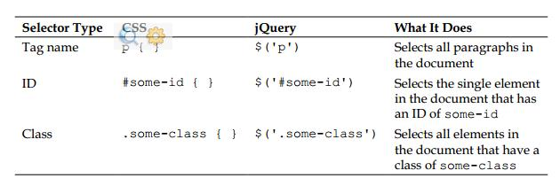

#选择元素
jquery使用css选择器让我们快速而容易的接触到DOM结构中的元素或者一组元素。在这一章中，我们将探索这些选择器中的一部分和jquery自己的选择器。我们也将查案jquery提供了更加灵活的让我们获取我们想要的东西的DOM遍历方法。

##文档对象模型
jquery最有力的能力之一是它使选择DOM结构中元素的变的容易的能力。文档对象模型作为js和网页的接口存在，他提供了基础html作为对象网而不是简单的文本的存在。

网状结构在网页上表现为家庭图谱的形式。当我们涉及到一个元素和其他元素的关系时，我们使用实际到家庭关系的术语：双亲，子代等等。一个简单的例子可以帮助我们理解家庭图谱如何映射到文档中的，如下：
代码

在这里，<html>shi 所有其他元素的祖先，换句话说，所有其他元素是<html>的后代。 <head>和<body>元素不仅仅是后代元素，还是<html>的子代元素。同样的，<html>不仅仅是他们的祖先元素，也是他们的父代。
元素是
的子代元素也是后代元素，也是<body>和<html>的后代元素，也是其他
的兄弟元素。正如下面的图表展示的那样。

为了帮助让DOM结构的家庭书结构变的更加形象，你可以使用一些软件工具，比如firefox上的firebug插件，或者Safari或者Chrome上的web探测器。

通过我们使用的元素树状图，我们可以使用jquery去有效的定位网页上的任何元素。我们实现这一点的工具就是jquery选择器和遍历方法。

在我们开始前，一个需要指出的重要一点是选择器和方法得到的结果中石碑jquery对象包围。当我们想实际在我们从网页上查找到的元素上做一些事情的时候，使用这些jquery对象将是很容易的。我们可以很容易的在这些对象上绑定事件，为他们添加流畅的影响，同时一起链状的修改影响他们。jquery对象与常规的DOM对象或者节点列表是不相同的，并没有必要的为一些任务添加相同的方法和属性。因此在这一章节的最后部分，我们将看一下直接接触被jquery对象包围着的DOM对象。

##$()方法
无论我们想在jquery中使用哪种类型的选择器，我们总是使用相同的函数$()开头。这个函数典型的接受一个css选择器作为他的基础的元素，然后作为一个工厂放回一个指向网页上相应元素的的新的jquery对象。任何能被样式表使用的东西都可以作为字符串传递给这个方法，允许我们把jquery方法应用到匹配的元素上。

使jquery和其他js库和谐相处
爱jquery中，美元符号$shi jquery的一个别名，然而一个$()方法在js的库中是很常见的，如果一个网页中使用了多个这些库，可能就会发生冲突。我们可以通过把我们的代码中所有的$替换成jquery来避免这样的冲突。这个问题的其他解决方案再第十章高级事件中介绍了。

三种基本的选择器构建元素分别是tag name ckass和id他们可以单独使用，也可以和其他结合起来使用。下面的简单的例子说明了这三个选择器如何在代码中呈现的。

- tag name      选择文档中所有的段落
- ID            选择文档中唯一的一个ID是some－id的元素
- Class         选择文档中有着some-class这个类的元素。

正如第一章：入门指南中介绍的那样，当我们调用jquery对象的方法的时候，我们传递给$()的选择器选中的对象将会自动隐式的循环。因此我们通常可以避免通常在DOM脚本中需要的显式调用。

现在我们已经讲述过了基础知识，我们准备好了去开始探索一些更加高级的选择器的使用。

##css选择器
jquery支持几乎所有的css1到3的规范，在世界万维网协会网站http://www.w3.org/Style/css/specs有一个概述。这份支持允许开发者扩展他们的网站，而不用担心这是哪一个浏览器（尤其是IE6）或许不懂高级选择器，只要浏览器支持js脚本就行。

渐进增强
有责任感的jquery开发者应该总是应用渐进增强和优雅降级的概念到自己代码中，确保这个网页将会精确的渲染，即使在js被禁用后不是像启用js后的那么漂亮。我们将在整本书中继续探索这个概念。
为了开始学习jquery如何使用css选择器工作，我们将使用在很多网站上出现的结构，通常是导航，一个嵌套的无序的列表：
代码

注意到第一个ul标签有一个selected-play ID，但是任何一个li标签上都没有类。在没有任何样式的情况下，这个列表看起来就像下面的截图一样。

这个嵌套的列表现实的好像我问期望他是一系列元素垂直排列，然后根据级别缩进。

##为项目列表添加样式

假设我们想要顶部元素，而且只想要顶部元素水平排列。我们可以先在样式表中定一个horizontal类。
horizontal类让元素浮动到他后续元素的左侧，去掉了他的项目图标，在他的各个方向添加了10像素的边距。
我们动态的在顶部元素（仅仅Comedies,Tragedies,Histories）添加了horizontal类，而不是直接在html标签上添加，展示了jquery作为选择器的使用，如下：
代码
正如在第一章中讨论的那样，我么通过调用$(document).ready()开始我们的jquery代码，他会在DOM加载结束后执行传递给他的代码，而不是之前。
第二行使用子代选择器仅仅为顶部元素添加horizontal类。他的作用是，$()内部的选择器方法正在说："找到每一个有着selected-play ID的元素的子元素列表项目(li)"。
在这个类现在被应用后，定义在样式表中的这个类的规则产生了作用。现在我们的嵌套列表看起来像下面的截图一样：

为所有的其他元素加上样式——所有的不在顶部的元素——可以使用多种方法实现。正如我们已经为顶级元素加上了top-level元素，一个选择子级元素的方法就是使用反向选择类去确定所有的没有添加horizontal的列表项目。注意下面添加的第三行代码：
代码

这一次，我们选择每一个列表元素li：
是selected-plays ID的后代元素(#delected-plays)
没有horizontal类(：not(.horizontal))

##属性选择器
属性选择器是一个相当有用css选择器的子集。

它允许我们通过一个元素的html属性去明确一个元素，比如一个链接的title属性或者一个图片的alt属性。

比如，为了选择所有有着alt属性的的图片，我们写下下面的$("img[alt]")属性选择器，接受一个使用有规则的表达式的通配符语法用来明确一个字符串开始（^）和结束（$）的值。

他们也可以使用星号（＊）去表明在某一个位置有某个值，或者使用叹号（！）去表明一个相反的值。

##为链接添加样式

我们想让不同的链接有不同的颜色，我们首先在样式表中定义样式，如下：
`a{
color: #00c;
}
a.mailto {
background: url(images/mail.png) no-repeat right top;
padding-right: 18px; }
a.pdflink {
background: url(images/pdf.png) no-repeat right top; padding-right: 18px;
}
a.henrylink {
background-color: #fff; padding: 2px;
border: 1px solid #000;
}
`


然后，我们添加三个类——mailto，pdflink和henrylink——使用jquery确定链接。

为了给所有的email链接加上一个类，我们建立了一个选择器，找到了所有的有着href属性的锚元素，而且是以mailto开头的：（^="mailto"）如下：

`$(document).ready(function() { $('a[href^="mailto:"]').addClass('mailto');
});`

由于在页面的样式表中定义的规则，一个信封的图片将显示在页面上所有的mailto链接后面，正如下面的－展示的那样：


为了给所有到PDF文件的链接加上一个类，我们使用美元符号而不是脱字符号^。这是因为我们正在选择一个href属性是以.pdf结尾的链接，如下：
`$(document).ready(function() { $('a[href^="mailto:"]').addClass('mailto'); $('a[href$=".pdf"]').addClass('pdflink');
});`

新添加的pdflink类的样式规则在每一个到PDF文件的链接后面加上了一个Adobe Acrobat图标，正如下面的截屏显示的那样：

属性选择器也可以连接使用，比如，我们可以为所有以http开头，而且在某个位置含有henry的href属性添加一个henrylink类：

`$(document).ready(function() { $('a[href^="mailto:"]').addClass('mailto'); $('a[href$=".pdf"]').addClass('pdflink'); $('a[href^="http"][href*="henry"]')
.addClass('henrylink'); });`

在这三个类添加到这三种链接以后，我们会看到下面这样的界面：

在之前的截屏中，你会看到PDF文件的图标在Hamlet链接的右侧，邮件图片在邮件链接的旁边，Henry V链接有着白色的背景和黑色的边框。

##定制选择器

在多种多样的css选择器之上，jquery添加了他自己独特的选择器。这些选择器在新的方面扩展了已经令人印象深刻的css选择器去定位页面中元素的能力。

####性能提示

jquery会尽可能的使用浏览器原生的DOM选择器引擎去查找元素。但是当定制选择器使用的时候，这个相当快速的方法通常是不能使用的。由于这个原因，当一个原生选项可用的时候，我们推荐避免经常使用定制选择器，性能是很重要的。

说起来，大部分定制选择器允许我们从一排元素中找到特定的元素，这种选择器依靠他们在之前选择的一组元素的位置确定元素，典型的在下面的css选择器中使用了。这个语法和css伪类语法一致，这个选择器以冒号开头，例如，为了选择一系列有着horizontal类的div元素中的第二个，我们写下了下面的代码：

`$('div.horizontal:eq(1)')`

注意:eq(1)选择了这组元素中的第二个，因为js数组是zero-base的，意味者js数组从0开始计数的，作为对比，css是one-base，因此一个如同$('div:nth-child(1)')的css选择器将选择他们父元素的第一个子元素（在这个场景下，我们当然还可以使用$('div:first-child')）。

##为交替的列加样式
jquey中有两个有用的选择器，:odd,:even，让我们看一下我们如何使用使用他们之一来为基础的表格加样式，见如下的表格：

`<h2>Shakespeare's Plays</h2> <table>
<tr>
<td>As You Like It</td> <t d>Comedy</ t d> <td></td>
</tr> <tr>
<td>All's Well that Ends Well</td> <t d>Comedy</ t d>
<t d>1601</ t d>
</tr> <tr>
<td>Hamlet</td> <td>Tragedy</ td> <t d>1604</ t d>
</tr> <tr>
<td>Macbeth</ td> <td>Tragedy</ td> <t d>1606</ t d>
</tr> <tr>
<td>Romeo and Juliet</td> <td>Tragedy</ td>
<t d>1595</ t d>
</tr> <tr>
<td>Henry IV, Part I</td> <td>History</td>
<t d>1596</ t d>
</tr> <tr>
<td>Henry V</td> <td>History</td> <t d>1599</ t d>
</tr>
</table>
<h2>Shakespeare's Sonnets</h2> <table>
<tr>
<td>The Fair Youth</td> <t d>1–126</ t d>
</tr> <tr>
<td>The Dark Lady</td>
<t d>127–152</ t d> </tr>
<tr>
<td>The Rival Poet</td> <t d>78–86</ t d>
</tr> </table>
`
通过样式表最少的样式，这些头部和表格显示的相当平常，这个表格有一个固定的白色背景，两个相邻的行之间没有分割样式：

现在我们在样式表中添加一个影响所有表的行的样式，然后使用alt类影响所有的偶数行：
`tr{
background-color: #fff;
}
.alt {
background-color: #ccc; }
`

最后，我们写下一个jquery代码，绑定这个类到表的所有的偶数行（<tr>标签）

`
$(document).ready(function() { $ ( ' t r : e ve n ' ) . a ddC l a s s ( ' a l t ' ) ;
});`

但是，等一下，为什么使用:even给所有的偶数行？因为，正如:eq()选择器一样，:even :odd使用了js原生的零基础的数字，因此，第一行数出来是0（偶数），第二行是不是（基数）等等。记住这个，我们我们期望我们简单的一点点代码创造一个看起来像下面的截屏一样的表格：

 注意在第二个表格中，这个结果可能不是我们想要的，正如在这个Plays表格中，最后一行有着这个"交替"的灰色背景，在Sonnets表格中，第一行有个这个简单的白色的背景。避免这种问题的一个方法是使用:nth-child()选择器，这个选择器依靠父元素计算元素的位置，而不是所有被选择的元素。这个选择器使用或者数字，odd，even作为他的参数。
`$(document).ready(function() {
$ ( ' t r : n t h - c h i l d ( odd ) ' ) . a ddC l a s s ( ' a l t ' ) ;
});`

正如之前说的，注意到:nth-child()只是从0开始计数的jquery选择器。为了像我们上面做的那样接触到相同的被装饰的行——排除第二个表格中出现的那种行为——我们需要使用odd而不是even作为参数。在使用这个选择器后，两个表都被很好的加上了条纹，正如在下面的截屏中显示的那样。

在最后一个接触定制选择器，我们假设由于一些原因，我们想要高亮所有的涉及到Henry展示出来的的表格。我们需要做的是——在添加一个可以使文字加粗和斜体的类到样式表（.highlight {font-weight: bold; font-style: italic;}）中以后——在我们的jquery代码中添加一行代码，使用:contains()选择器，正如下面的代码片段显示的那样。
`$(document).ready(function() {
$ ( ' t r : n t h - c h i l d ( odd ) ' ) . a ddC l a s s ( ' a l t ' ) ;
$(' td:contains(Henry)').addClass('highlight ');
});
`

现在我们可以看到我们漂亮的加了条纹的表格，其中Henry展示了显著的特点：

有一点特别需要说明的是:contains()选择器是大小写敏感的，使用$("td:contains(henry)")，而不是使用大写的H，将不会选择任何元素。

诚然，我们有很多方法在不使用jquery可以实现给表加上条纹和文字高亮的目的——或者是任何浏览器端的编程。但是，使用jquery和css，是实现这种类型的修饰的特别好的选择，尤其是在内容是动态添加的而且我们不能接触到html或者服务器端代码的情况下。

##表单选择器
定制选择器的能力不仅仅局限在依靠元素的位置来定位元素。例如，当我们使用表单的时候，jquery定制选择器和css3选择器可以让我们选择我们需要的元素变得简单。下面的表格描述了一些表单选择器：

选择器    匹配

- :input    input,textarea,select,button元素
- :button    Button元素，type属性为butto的input元素
- :enabled    可用的表单元素
- :disabled    被禁用的表单元素
- :checked    被选择的Radio按钮和checkbox
- :selected    被选择的option元素

和其他选择器一起，表单选择器可以连接起来做到更强大的专一性。比如，我们可以使用`$('input[type="radio"]:checked')`选择所有的被选择的radio按钮（不包括checkbox），或者我们可以使用$('input[type="password"],input[type="text"]:disabled')选择所有的password输入框和被禁用的文本输入框。甚至使用定制选择器，我们可以使用相同的css的基本原则创建被匹配的元素的列表。
我们仅仅描述了可用的选择器表达式的很浅的东西，我们将在第九章”高级选择器和遍历“更深入的讲解这个主题。

##DOM遍历方法
到目前为止我们探索过的jquery选择器允许我们在操纵DOM树的时候选择一串元素，然后过滤结果。如果只有一种方法选择元素，我们的选择将会受到限制（尽管，坦白说，和原生的DOM选择器比起来，这些选择器表达式凭他们本身已经非常健壮了）有很多情况下选择一个父元素或者祖先元素是必须的，这就是jQuery的DOM遍历方法出现的原因。通过这些方法，我们可以很容易的遍历整个DOM树。

一些方法的选择器表达式拥有几乎相同的副本。比如，我们开始使用去添加alt类的代码$("tr:even").addClass("alt")，可以使用.filter()重写，就像下面这样$("tr").filter(":even").addClass("alt")，然而在很多地方，这两种选择元素的方法互为补充。

另外，尤其是.filter()方法有着巨大的魔力，因为他可以把一个函数作为参数。这个函数允许我们创建一个复杂的测试用来判断元素是否应该被存放在集合中。比如，让我们假设，我们想要给所有的外部链接添加一个类。jquery对这种场景并没有一个选择器。在没有一个过滤方法的情况下，我们将强迫显式循环遍历每一个元素，分开测试每一个元素。然而通过使用下面的过滤函数，我们仍然依靠jqueyr的隐式迭代，让我们的代码很紧凑：$('a').filter(function() { return this.hostname && this.hostname != location.hostname;}).addClass('external');

第二行代码通过下面这两个准则过滤了a元素集合：
1、他们必须有一个href属性，而且含有域名（this.hostname）。我们使用这个测试排除类似于mailto链接。
2、他们连接到的域名必须不是当前页的域名地址（location.hostname）。
更精确的说，.filter()方法迭代调用匹配的元素集合，为每一个元素调用函数，然后检查返回值。如果返回false，这个元素将被从匹配的元素集合中移除。如果返回值是true，这个元素将会被保留：

在下面的小节，我们将再看一下我们加了条纹的列表去查看一下通过遍历方法，我们还能做到哪些事情。

##为特定的方块添加样式

之前，我们为所有包含文本Henry的方格添加了一个highlight类。为了给每一个包含Henry下一个方格加样式，我们可以以我们已经写下的选择器开始，然后仅仅在结果中调用一下.next()方法，如下：$(document).ready(function() { $('td:contains(Henry)').next().addClass('highlight');});
现在，这个表看起来像下面的截图一样：

.next()方法仅仅选择了恰好挨着的兄弟节点。为了让包含Henry元素后面的所有的方块高亮，我们应该使用.nextAll()方法：
$(document).ready(function() { $('td:contains(Henry)').nextAll().addClass('highlight');});

由于包含Henry的文本在表格的第一列，这段代码导致这几行中其余的方块都高亮了。正如在下面的截屏中展示的那样：

我们可能想到.next() .nextAll()方法有着类似的东东：.prev() .prevAll()。另外，.siblings()选择了所有的在同一DOM层级的其他的元素，而不管他们是出现在之前选择的元素的前面还是后面。
为了包含最开始的方块（包含Henry文字的那一个）和后面的方块一起，我们添加l.andSelf()方法，如下：$(document).ready(function() { $('td:contains(Henry)').nextAll().andSelf() .addClass('highlight');});
在修改了这些地方以后，这一行中所有的方格都有着在highlight类定义的样式，如下：

为了确定，有很多选择器和遍历的方法的范例，通过他们我们可以选择相同的元素集合。比如，在这里有另外一个选择至少有一个方格含有Henry的一行每一个元素的方法：

`$(document).ready(function() { $('td:contains(Henry)').parent().children() .addClass('highlight');})`

在这里，我们没有遍历兄弟节点，我们向上走了一层，通过.parent()找到了tr元素，然后通过.children()找到了这一行的所有元素。

##链式操作
我们探索过的遍历方法范例展示了jquery的链状能力。使用jquery，我们可以选择很多元素组合，然后在他们身上做很多事情，而这只需要一行代码。战中链锁不仅仅让jquery代码变得简洁，而且还能提高在我们重新选择元素时脚本选择元素的性能。

####链锁如何工作
我们将在以后很仔细的讨论一下链锁是如何实现的。现在，只要清楚几乎所有的jquery方法返回一个jquery对象就好了，因此我们可以有更多的jquery方法适用到结果上。

为了更好的可读性，我们当然可以把单行代码打散成多行。比如，一个链状的方法组合可以被写成一行：
`$( ' td:contains(Henry) ' ).parent().find( ' td:eq(1) ' ) . a ddC l a s s ( ' h i gh l i gh t ' ) . e nd ( ) . f i nd ( ' t d : e q ( 2 ) ' )
. a ddC l a s s ( ' h i gh l i gh t ' ) ;`

也可以被写成多行：

`$( ' td:contains(Henry) ' ) / / Find every cel l containing "Henry" .parent() // Select its parent
.find('td:eq(1)') // Find the 2nd descendant cell .addClass('highlight') // Add the "highlight" class
.end() / / Return to the parent of the cel l containing "Henry" .find('td:eq(2)') // Find the 3rd descendant cell .addClass('highlight'); // Add the "highlight" class
`

诚然，在这个例子中的DOM遍历的迂回性在一定程度上很荒谬。我们当然不推荐这样使用，因为我们可以使用更加简单的更加直接的方法。这个例子的重点只是展示。  

链锁作用好像就是一口气说了一整段文字——我们很快的完成了这个工作，但是他可能对某些人来说很难理解。把他打断成多行然后添加清晰的注释，从长期来讲将节省更多的时间。

##接触DOM元素

每一个选择器表达式和大部分的jquery方法返回了一个jquery对象。至几乎总是我们想要的，因为它提供了隐式迭代和链锁所用。

然而在我们的代码中还有有一些地方我们想要接触到DOM元素。比如，我们可能想让一系列元素可以让其他的js库使用。另外，我们可能需要接触到一个元素的名字，使用DOM元素的属性可以做到这一点。对这些公认很少出现的场景，jquery提供了.get()方法可以由jquery对象引用。我们将使用.get(0)。如果DOM元素是在一个循环中被需要的，我们将使用.get(index)。因此，如果我们想要知道id是my-element的元素的名字，我们将使用下面的代码片段：

`var myTag=$("#my-element").get(0).tagName；`

为了更好的便利性，jquery为get()提供了一个快捷方式。我们可以在选择器后面使用中括号，而不用写之前的代码：

`var myTag = $('#my-element')[0].tagName;`

毫无意外，这个语法看起来想是我们把jquery对象当成DOM元素数组来看待，使用方括号好像是去到了jquery对象的外包装，然后得到了dom元素列表，包括index（在这里是0），好像是把DOM元素自己扯了出来。

##总结
拥有了本章我们讲过的知识后，我们现在可以通过很多方法定位网页上的一串元素。特别的，我们学会了使用基础的css选择器在嵌套的结构中去定位顶部和子级的元素，学会了使用属性选择器为不同类型的链接加上不同的样式，使用定制选择器:odd和:even或者高级选择器:nth-child()给一个表加上交替的条纹，使用链状jquery方法为特定的表格块高亮文本。

到目前为止，我们已经使用了$(document).ready()方法为一些匹配的元素集合添加方法。在下一章节，我们将学习如何相应用户的起始事件来添加一个类。

##延伸阅读
选择器和遍历方法的主题将在第九章详细的研究。jquery选择器和遍历方法详细的列表可以在本书的附录C，jquery相关指导，或者在官方jquery文档
[http://api.jquery.com](http://api.jquery.com)中可以找到。

##练习

为了完成这些练习，你需要这一章的一个index.html文件，何忧在complete.js中的一根已经完成的js代码。这些文件可以从Packt Publishing 网站：http://ww.packtpub.com/support上下载下来。
这些富有挑战的练习可能需要使用http://api.jquery.com的官方jquery文档。

1. 为所有嵌套列表的第二层级的li元素添加一个special类。
2. 为所有在表格中的第三列的方格加上一个year类。
3. 为表格的含有Tragedy单词的第一行家还是那个一个special类
4. 挑战：选择所有的含有链接（a）的列表项（li）。为选择的这些元素的后面的兄弟列表节点添加一个afterlink类。
5. 挑战：为所有.pdf链接的最近的祖先ul元素添加一个tragedy类。

