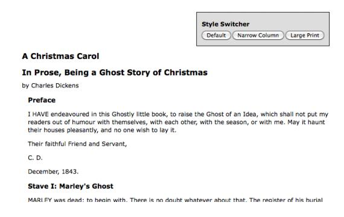
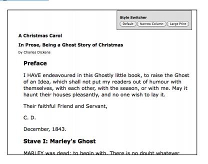
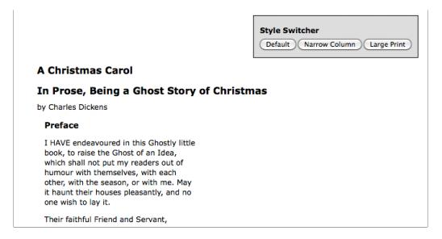

#第三章：事件处理

js有几个内置的方法对用户的操作和其他事件作出反应。为了让一个网页是动态的，而且可响应我们需要驾驭这种能力，以便于我们可以在恰当的时间使用我们目前学到的jquery基数和一会学到的其他技巧。尽管我们可以通过js来做这些事情，jquery扩展增强了基本事件的处理能力，提供了更加优雅的语法，同时让他变的更加强大。

##在页面加载的时候执行任务

我们已经看到了如何让jquery为加载网页做出反应。$(document).ready()事件处理器可以被用来启动一段代码的函数作用，但是这里还有有一些东西需要讲一下。

##代码执行的顺序
在第一张，入门指南中，我们说明了$(document).ready()是jquery用来在页面加载的时候执行任务的私有的方法。然而，他不是我们可用的唯一的方法。原生的window.onload事件可以实现相似的影响。随涨这两个方法是相似的，但是辨别出他们在执行是的不同是十分重要的，尽管他们可能只是在加载资源的数量上有着微妙的不同。

window.onload事件在文档完全被加载到浏览器的时候执行。这意味着网页上每一个元素已经可以被js操纵了。这对我们写有特色的代码而不用担心加载顺序这一点是一个福利。

另一方面，使用$(document).ready()注册的方法在DOM结构完全可以使用的时候被调用。这也意味着所有的元素可以通过我们的脚本来接触到，但是这不意味着所有相关的文件已经被下载下来了。一旦HTML已经被加载而且被解析成DOM树的时候，这段代码就可以执行了。

####样式加载和代码执行

为了确保在js代码执行之前已经加载了样式，在文档的head元素里面把``
``
``
``

首先，另外一个库被引入（这里用Prototype做例子），然后，jquery自己被引入，拿来＄自己使用。接着，调用 `.noConflict()`函数释放＄的控制权，于是对＄的控制权重新复原到最初被包含的库（Prototype）中。现在我们一般脚本可以使用两个库了，但是无论何时我们想使用一个jquery方法，我们需要写下jQuery作为标示符，而不是＄。

`.ready()`方法有不仅仅一个方法帮助我们处理这种场景。我们传递给他的回调函数可以拥有一个参数：jquery对象自己。这允许我们有效地重命名他，而不用担心冲突，正如下面的代码展示的那样：
`jQuery(document).ready(function($) {// In here, we can use $ like normal!});`
或者，使用我们在之前的代码中学到的更加简短的语法：
`jQuery(function($) { // Code that uses $.
});`


##简单事件

有很多时候，我们想绑定一些事件，而不仅仅是在加载网页的时候触发。正如js允许我们使用<body onload=''>和window.onload监听网页加载事件，他也提供了相似的拦截器用来对用户事件作出反应，比如鼠标的点击事件（onclick），表单元素被修改（onchange）和窗口大小被修改（onresize）。当我们直接绑定到DOM中的元素上的时候，这些拦截器和之前我们描述过的onload有着相似的缺点。因此，jquery对这些方法也提供了高级的处理方法。


##一个简单的风格切换器

为了研究一些事件处理技术，假定我们希望让一个网页由用户输入的来决定不同的渲染样式。我们将让用户点击按钮来让网页在三个样式中切换：一个正常视图，一个文本的行间距变窄的视图，一个文本区域是大号字体的视图。

>####渐进增强
在真实世界中，一个好的web开发者将使用渐进增强的原则。在js不可用的时候风格切换器应该被隐藏，或者仍然可以通过链接到不同版本的网页来生效。为了这个教学的目的，我们假定所有用户的js功能都被开启了。

样式切换器的html标记如下：
`
 <h3>Style Switcher</h3>
<button id="switcher-default">
Default
</button>
<button id="switcher-narrow">
Narrow Column
</button>
<button id="switcher-large">
Large Print </button>
`

将剩下网页的html标记和一些基本的css连接起来，我们将得到看起来像下面这样的网页：

开始，我们先让大号字体的按钮可用。我们需要一些css去实现我们的可选的网页视图，就像下面到代码片段一样：

`body.large .chapter { font-size: 1.5em;}`

我们的目标是将large类添加到body标签上。这将会让样式表重新恰当的让网页重新格式化。使用我们在第二章选择元素中学到的，我们需要下面的表达式来实现这个目标：

`$( 'body' ).addClass('large');`

然而，我们想要这个在按钮被点击的时候发生，而不是像我们现在看到的那样在网页被加载的时候发生。为了做到这点，我们引入了.bind()函数。这个方法允许我们特殊化DOM事件，然后在上面绑定行为。在这种场景下，事件应该是click，行为应该是由我们之前的一行代码组成的函数：

`$(document).ready(function() { $('#switcher-large').bind('click' ,
$( 'body' ).addClass( ' large' ); });
});`

现在，当按钮被点击的时候，我们的代码将会运行，文字将会变大，正如下面的截图展示的那样：

这就是为事件绑定行为的所有内容。我们讨论.ready()方法的优点在这里也适用。如果需要追加新的行为到相同的事件时，多次调用.bind()函数也可以和平相处。

这并不是实现这一目标的最优雅或者最有效的方法。在我们进行整章的时候，我们将扩展改善我们的代码，让他成为我们骄傲的存在。

##让其他按钮可用
我们现在有了一个像之前介绍的那样工作的大号字体按钮，现在我们需要为另外两个按钮（默认和窄间距按钮）添加相似的处理器，让他们可以完成自己的任务。这次很直接，我们使用.bind()为他们都添加一个click处理器，移去和添加类。新的代码像下面的代码片段一样：

`$(document).ready(function() { $('#switcher-default').bind('click', function() {
$('body').removeClass('narrow');
$( 'body' ).removeClass( ' large' ); });
$('#switcher-narrow').bind('click' , $('body').addClass('narrow');
$( 'body' ).removeClass( ' large' );
}); $('#switcher-large').bind('click' ,
$('body').removeClass('narrow');
$( 'body' ).addClass( ' large' ); });
});`

这些和为narrow 类设计的css规则一起使用：

`body.narrow .chapter { width: 250px;
}`

现在点击窄行间距按钮后，对应的css将会被应用，然后文本将会变得不同：

点击默认按钮，将移去body标签上的两个类，染回网页初始渲染的样子。

##事件处理上下文
我们的切换器表现的很好，但是我们没有给用户任何关于哪一个按钮目前是激活的反馈。我们解决这件事的方法是当按钮被点击后，为按钮添加一个selected类，然后移除其他按钮上的这个类。selected类可以让按钮的文字变粗：

`.selected { font-weight: bold;}`

我们可以通过ID引用到每一个按钮，然后实现对之前的类的修改，必要时可以修改其他类和移除类，但是我们将探索一种更加强大和可扩展的解决方案——采用事件处理器的上下文。

当事件处理器被触发以后，关键词this会指向行为被附加的DOM元素。之前，我们说过，$()可以使用DOM元素作为他的参数，这就是这种能力可以使用的关键因素之一。通过在事件处理器中书写$(this)，我们创建了一个相应的jquery对象，然后可以像我们使用css选择器定位了他一样来在上面添加行为。

在知道这一点以后，我们可以写出下面这样的代码片段：

`$(this).addClass('selected');`

把这行代码放在这三个处理器的每一个中，将会在按钮被点击以后添加上这个类。为了移除其他按钮的这个类，我们可以借助jquery的隐式迭代的特点，写下下面这样的代码段：

`$('#switcher button').removeClass('selected');`

这行将会移除风格切换器内部的每一个按钮的类。

我们也可以在文档模型可以使用的时候为默认按钮添加这个类。因此，将这些代码以正确的顺序排列，我们将有下面的代码片段：

`$(document).ready(function() { $( ' #swi tcher-defaul t ' )
.addClass('selected') .bind('click', function() {
$('body').removeClass('narrow');
$( 'body' ).removeClass( ' large' );
$('#switcher button').removeClass('selected'); $(this).addClass('selected');
});
$('#switcher-narrow').bind('click' , function() {
$('body').addClass('narrow');
$( 'body' ).removeClass( ' large' );
$('#switcher button').removeClass('selected'); $(this).addClass('selected');
});
$('#switcher-large').bind('click' , function() {
$('body').removeClass('narrow');
$( 'body' ).addClass( ' large' );
$('#switcher button').removeClass('selected'); $(this).addClass('selected');
}); });`

现在风格切换器有了正确的反馈。

通过使用事件处理上下文来实现语句，让我们变的更加高效。我们可以吧高亮的功能拆分到不同的处理器中，正如在li s t3.4中展示的那样。因为这对所有的三个按钮来说是相同的。

`$(document).ready(function() { $( ' #swi tcher-defaul t ' )
.addClass('selected') .bind('click', function() {
$( 'body' ).removeClass( 'narrow' ).removeClass( ' large' ); });
$('#switcher-narrow').bind('click' , function() {
$( 'body' ).addClass( 'narrow' ).removeClass( ' large' );
});
$('#switcher-large').bind('click' , function() {
$( 'body' ).removeClass( 'narrow' ).addClass( ' large' ); });
$('#switcher button').bind('click' , function() { $('#switcher button').removeClass('selected'); $(this).addClass('selected');
}); });`

这种优化方法使用了我们讨论过的三个jquery特点的优势。首先，在一次，我们使用隐式继承，当我们单单调用.bind()来为每一个按钮绑定click事件的时候，这是很有用的。第二，行为序列按我们在同一个点击事件上绑定了两个函数，而不会担心第二个函数会吧第一个覆盖。最后，我们使用了jquery的__链式能力__，在一行代码中用简练的代码实现了添加和移除类。

##更远的巩固
我们刚刚完成的代码优化是一个代码重构的例子——修改已经存在的代码，让他们以一种更加高效更加强大的方式实现相同的任务。为了更深入的研究重构的可能，我们看一下绑定到每一个按钮的行为。.removeClass()的参数是可选的，当被省略后，它将移除这个元素的所有的类。我们可以通过这个特点来让我们的代码更加高效，就像下面一样。

`// work in progress 
$(document).ready(function() {
$( ' #swi tcher-defaul t ' )
.addClass('selected') .bind('click', function() {
$('body').removeClass(); });
$('#switcher-narrow').bind('click' , $('body').removeClass().addClass('narrow');
});
$('#switcher-large').bind('click' , function() {
$( 'body' ).removeClass().addClass( ' large' ); });
$('#switcher button').bind('click' , function() { $('#switcher button').removeClass('selected'); $(this).addClass('selected');
}); });`

注意一下，我们的操作的顺序变了一点，以便于我们可以我们更加一般的类的移除。我们需要先运行.removeclass()函数，以便于他不会撤销我们几乎在同一瞬间实现的.addclass()方法。

>我们可以安全的移除所有的类，因为在这种场景下我们完全控制html。当我们书写代码来重用的时候（比如一个插件），我们需要考虑所有的可能被呈现或者不使用的类。

现在我们在每一个按钮处理器上运行一些相似的代码。这可以很容易的拆分成普通的按钮点击事件，正如下面的代码显示的那样：

`$(document).ready(function() { $('#switcher-default ').addClass('selected');
$('#switcher button').bind('click' , function() { $('body').removeClass();
$('#switcher button').removeClass('selected'); $(this).addClass('selected');
function() {
});
$('#switcher-narrow').bind('click' , $('body').addClass('narrow');
function() {
});
$('#switcher-large').bind('click' , $( 'body' ).addClass( ' large' );
}); });
`

我们注意到，我们需要把一般处理器移动到特殊处理器之上，这个.removeClass（）方法需要发生在addclass方法之前，我们可以做到这一点，因为jquery总是按照事件被注册的顺序触发事件。最后，我们可以再一次通过事件处理上下文完全避免特定的事件处理器。上下文关键字this提供了一个dom对象而不是jquery对象，我们可以使用原生的dom属性来决定被点击的元素的id。因此，我们可以为所有的按钮绑定相同的处理器，通过这个处理器为每一个按钮表现不同的行为。代码如下

`
$(document).ready(function() { $('#switcher-default ').addClass('selected');
$('#switcher button').bind('click' , function() { var bodyClass = this.id.split('-')[1];
$('body').removeClass().addClass(bodyClass);
$('#switcher button').removeClass('selected');
$(this).addClass('selected'); });
});
`

bodyclass变量的值将会根据被点击的按钮来赋予default，narrow，large不同的值。现在我们的代码变的和之前的有些不一样了，当用户点击button Id=switcher-default之后，我们在body上添加了一个defaut类。尽管我们不需要这个类，但是它并没有造成任何坏处，而且降低代码的复杂性弥补了多出一个不被使用的类名的缺点。

##事件的缩写
给一个事件绑定处理器，比如click事件，是一个相当常见的任务，因此jquery提供了一个更加简洁的方法来实现。事件处理快捷方式按照在bind方法中相同的方法工作，但是却可以少输入一些字母。
例如，我们的事件处理器，可以使用click而不用bind方法，正如下面的代码显示的那样。

`$(document).ready(function() { $('#switcher-default ').addClass('selected');
$('#switcher button').click(function() { var bodyClass = this.id.split('-')[1];
$('body').removeClass().addClass(bodyClass);
$('#switcher button').removeClass('selected');
$(this).addClass('selected'); });
});
`

事件方法的缩写为所有的标准dom事件都处理了，请看如下清单：
事件列表。

- blur
- change
- click
- dblclick
- error
- focus
- keydown
- keypress
- keyup
- load
- mousedown
- mousemove
- mouseout
- mouseover
- mouseup
- resize
- scroll
- select
- submit
- unload

每一个快捷方法都给被合适命名的事件绑定了一个处理器。

##复合方法

大部分jquery事件处理方法和原生的DOM方法相对应。然而少数的一般处理器被添加进来了，用来提供便利和跨浏览器的兼容性。我们曾经很细节的讨论过的.ready()就是其中之一的方法。另外，括.mouseenter(),.mouseleave(),focusin()和focusout()方法，规范化IE的同名事件。两个一般jquery处理器，.toggle()和.hover()被用来当作复合事件处理器，因为他们拦截了用户的连续事件，同时使用多个函数做出反应。

##展示和隐藏高级特点

假如我们想要在风格切换器不需要的时候隐藏他。一个隐藏高级特点的便利的方法就是让他们可折叠。我们将用户点击标签的时候隐藏按钮，而只留下标签。再见一下标签的时候，按钮将会重新出现。我们需要另一个类去处理隐藏的按钮，如下：

`.hidden { display: none;}`

我们可以通过一个变量存储按钮当时的状态来实现这个特点，然后在每一次点击标签的时候检查一下这个变量的值来确定是否要添加还是移除按钮上的隐藏的类。我们也可以直接检查当时这个按钮上面的类，然后使用这个信息来决定我们要去做什么。但是，jquery提供了一个.toggle()方法，他可以帮我们完成这个内部事件。

> ##肘节效应
事实上jquery定义了两个.toggle方法想看更多的关于这个名字的方法的作用（通过不同的参数类型进行区分），请看：[http://api.jquery.com/toggle/](http://api.jquery.com/toggle/)

.toggle()方法需要两个或者更多的参数，每一个都是函数。第一次点击将会调用第一个函数，第二次点击将会调用第二个函数等等。一旦每一个函数都被调用了以后，将会从第一个函数重新开始循环。使用.toggle()方法，我们可以非常简单的实现我们的可折叠的风格切换器。

`$(document).ready(function() { $('#switcher h3').toggle(function() {
$('#switcher button').addClass('hidden'); }, function() {
$('#switcher button').removeClass('hidden'); });
});`

在第一次点击后，所有的按钮都被隐藏了:

在第二次点击后他们又重新可见了：

这一次我们又是使用了隐式迭代的特点。这时候隐藏所有的元素一下子就实现了，而不用请求内部的元素。

在这种特殊的场景下，jquery提供了另外一种机制用来实现我们需要的折叠。我们使用.toggleClass()来自动在添加或者移除之前检查当前类：

`$(document).ready(function() { $('#switcher h3').click(function() {
$('#switcher button').toggleClass('hidden'); });
});`

在这种场景下，.toggleClass()可能是最又优雅的解决方案了，但是.toggle()事实是表现一连串串联行为的通用的方法。

##

